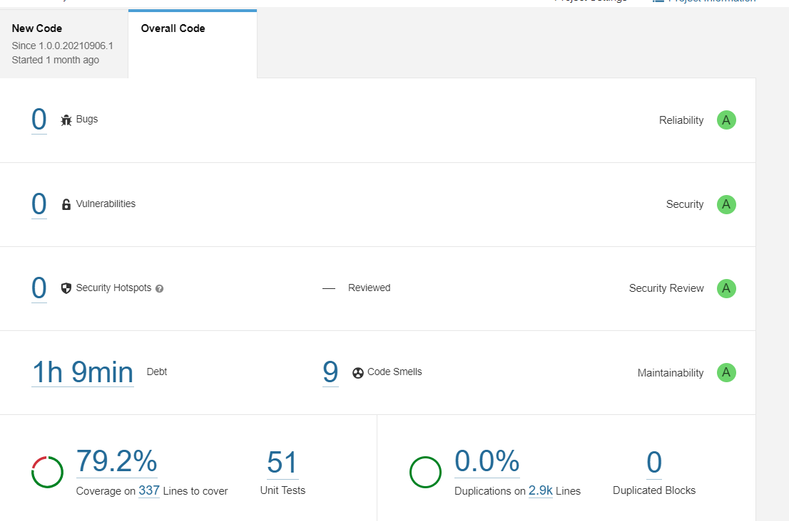

# NestJS Project

## Description

This is a Skeleton application for building REST APIs in Nest JS. It covers various aspects of the project, including installation, usage, configuration and additional features.

## Installation

```bash
$ npm install
$ npm i -g @nestjs/cli
```


App Skeleton

```
.
├── bin/
├── src/
│   ├── cache/
│   ├── constants/
│   ├── core/
│   │   ├── app.config/
│   │   ├── decorator/
│   │   ├── guard/
│   │   ├── interceptors/
│   │   ├── jwt/
│   │   ├── middleware/
│   │   ├── swagger/
│   │   ├── utils/
│   │   ├── core/
│   ├── filters/
│   ├── helpers/
│   ├── i18n/
│   ├── lib/
│   ├── modules/
│   │   ├── api/
│   │   │   ├── auth/
│   │   │   ├── master/
│   │   │   ├── server/
│   │   │   ├── v1/
│   │   │   │   ├── user/
│   ├── repo/
│   │   ├── sequelize/
│   ├── main.ts
│   ├── app.module.ts
├── nest-cli.json
├── package.json
├── package-lock.json
├── README.md
├── tsconfig.build.json
├── tsconfig.json
```

### Pre-requisite

---

-   Node.js - version 16.14.0
-   NPM - 6.14 +
-   MySQL 8x

---


### Features
-   Authentication : Two types of authentication available in this template
Password-Based Authentication: Users can authenticate themselves using a password
OTP-Based Authentication: Users can authenticate themselves using One-Time Passwords (OTPs)
-   Role-Based Authorization: Users are assigned specific roles that determine their access privileges within the system. Different roles have different levels of access and permissions.
-   Code Linting: This project includes a linting capabilities to enforce coding standards and best practices.
-   Prettier: This project includes a code formatter that enforces consistent code style across the project.
-   CORS Configuration: The project handles Cross-Origin Resource Sharing to control access to resources from different domains.
-   Debugging: The project includes debugging capabilities to identify and fix issues in the code. To enable debugging sequelize query logs and other logs by setting DEBUG env variable.
-   API parameters and payloads can be validated using Joi or NestJS pipes and return a response with errors if any of the configured validation rules fail.
-   Internationalization Support: The project includes features to support internationalization and localization.
-   sequelizejs: ORM for Node application and supports dialects MySQL
-   Azure pipeline: This project contains azure pipeline deployment configurations
-   Swagger: This project contains swagger that simplifies the documentation and testing of RESTful APIs
-   SonarLint: This project contains sonarlint that analyzes code and provides real-time feedback on issues such as bugs, vulnerabilities, and code smells
-   Code Coverage: This project supports Jest testcases and coverage reports can be viewed in browser and as well as using sonarqube. Aim for a code coverage of at least 85% to ensure comprehensive testing and minimize the risk of undiscovered bugs.

### MySQL Configurations

**Increase MySQL max connection limit: **
go to “vi /etc/my.cnf” and add the below line to it and restart the mysql server.

```sh
[mysqld]
max_connections = 1000
```

**Enable sql_mode=only_full_group_by: **
go to “vi /etc/my.cnf” and add the below line to it and restart the mysql server.

```sh
[mysqld]
sql_mode=STRICT_TRANS_TABLES,NO_ZERO_IN_DATE,NO_ZERO_DATE,ERROR_FOR_DIVISION_BY_ZERO,NO_ENGINE_SUBSTITUTION
```
**Setting up database**

Import the database from bin/database folder

## Running the app

---

To get start clone the repository:

###### Change directory and install npm dependencies

```sh
$ cd myproject
$ npm install
```

## Set up environment

In root folder you can find `.env`. You can create the env file for different environments based this config or change it for your purposes.

- .env - app common configurations
- .env.test - test configurations

###### To start in local development mode with auto reload feature on code change.

```sh
# To run local server
$ npm run start:local
```

###### To start the unit test in parallel, open new terminal and run below code.

```sh
$ npm run test
```

###### To verify and fix the code linting

```sh
$ npm run lint
$ npm run lint:fix
```

### Environment specific compilation and build for server deployment.

---

### Deployment Steps

-   Production

    #### Step1: To build

    ```sh
    $ cd /var/www/{{project_folder}}
    $ git pull origin master
    $ npm install
    $ npm run build
    ```

    #### Step2: To Run Node server

    ```sh
    $ cd /var/www/{{target_folder}}
    $ cp /var/www/{{project_folder}}/dist  .
    $ npm install
    $ npm run start
    ```

-   Other Environments. [Refer scripts section for additional info]

    #### Step1: To build

    ```sh
    $ cd /var/www/{{project_folder}}
    $ git pull origin {{branch}}
    $ npm install
    $ npm run build:{{environment}}
    ```

    #### Step2: To Run Node server

    ```sh
    $ cd /var/www/{{target_folder}}
    $ cp /var/www/{{project_folder}}/dist  .
    $ npm install
    $ npm run start:{{environment}}
    ```

---

##### Note:
This project uses mysql with sequelize by default, To change the different configuration update the environment value DB_ORM_NAME 


## Test

```bash
# unit tests
$ npm run test

# e2e tests
$ npm run test:e2e

# test coverage
$ npm run test:cov

# lint
$ npm run lint
```

### Scripts

Below is the collection of npm scripts used in this code base,

-   `start`: Run the application in production mode (prefer not to do that in development)
-   `start:local`: Run the application for local server
-   `start:dev`: Run the application for development server
-   `start:qa`: Run the application for qa server
-   `start:testing`: Run the application for testing server
-   `start:staging`: Run the application for staging server
-   `build`: To Build the application for production server
-   `build:dev`: To Build the application for development server
-   `build:qa`: To Build the application for qa server
-   `build:testing`: To Build the application for testing server
-   `build:staging`: To Build the application for staging server
-   `dev:debug`: Run the application in development mode without hot reloading for debugging in server
-   `qa:debug`: Run the application in qa mode without hot reloading for debugging in server
-   `test`: Run only the unit tests
-   `test:watch`: Run only the unit tests in watch mode
-   `test:debug`: Run only the tests in debug mode
-   `test:e2e`: Run only the integration tests with test db.
-   `compileTs`: Compile TypeScript files
-   `lint`: Lint the codebase
-   `lint:fix`: To fix Lint errors in codebase
-   `stop`: stop all pm2 process
---

#### Template Generation:

##### To generate code templates refer the nest js documentation https://docs.nestjs.com/recipes/crud-generator.


#### Code coverage:


#### SonarQube report:


### Git Branching Model

- The production branch for this project is `master`. No direct commits or PRs should be created towards this branch.
- Only critical production issues will be fixed in a branch taken from main and should be created as PR.
- The regular development activities will happen on the `develop` branch. No Direct commit should be done to the development branch.
- For each ticket, the developer should create a new branch from `develop`. This branch is known as feature branch.
- Feature branches are short-lived and should be deleted once the feature is completed and the PR is merged.
- Feature branches should follow the naming convention like `feature/ticketID-short-description`. Example: `feature/6813-authentication-changes`
- We should use atomic commits and branches. Meaning, each branch must either be a bug fix or a refactor or a new feature. Changes of different kind should not be done in the same branch.
- Commits should always contain working state code. For no reason, a broken state of the application has to be committed and pushed into VCS.
- **Never force push**, only valid reason is when you rebased recently or solved a merge conflict.
- Merge PRs by creating merge commits, squashing them overwrites the git history and gives undesirable results on `git blame`.
- The above list is not exhaustive, always good to take a step back and discuss what you're doing with the team before doing it.

---

### Todo

- Need to update test cases
- Need to docker support